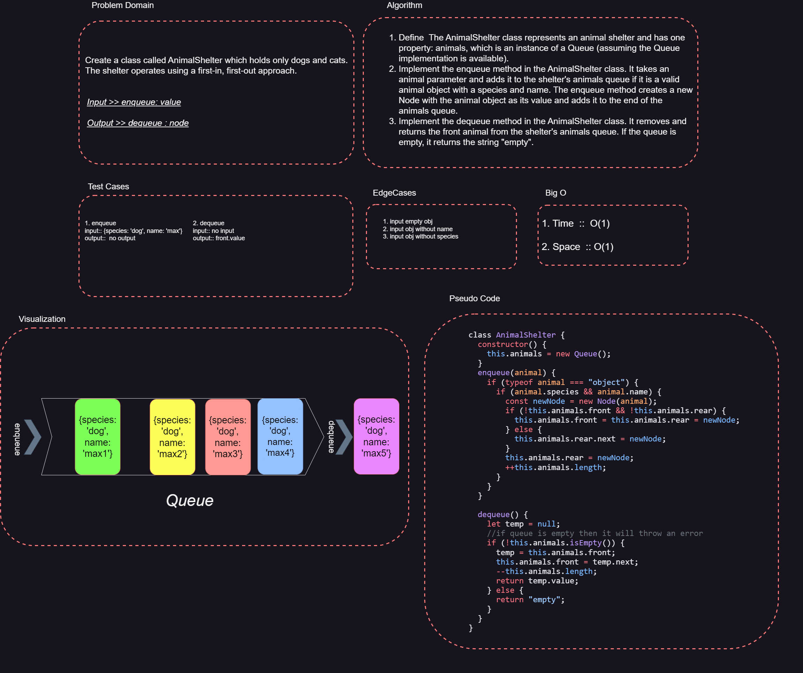

Certainly! Here's an example of a README file for the provided code:

# Animal Shelter

This project implements an Animal Shelter system using JavaScript. It provides a class called `AnimalShelter` that allows you to enqueue animals and dequeue them based on the order they were added.

## Features

- Enqueue: Add an animal to the shelter.
- Dequeue: Remove and retrieve the oldest animal from the shelter.

## Whiteboard



## Usage

1. Import the `AnimalShelter` class into your JavaScript file:

   ```javascript
   const AnimalShelter = require('./AnimalShelter');
   ```

2. Create an instance of the `AnimalShelter`:

   ```javascript
   const shelter = new AnimalShelter();
   ```

3. Enqueue animals by calling the `enqueue` method and passing an animal object with a `species` and `name`:

   ```javascript
   shelter.enqueue({ species: 'Dog', name: 'Max' });
   shelter.enqueue({ species: 'Cat', name: 'Whiskers' });
   ```

4. Dequeue animals from the shelter using the `dequeue` method:

   ```javascript
   const oldestAnimal = shelter.dequeue();
   console.log(oldestAnimal); // { species: 'Dog', name: 'Max' }
   ```

   The `dequeue` method will remove and return the oldest animal from the shelter.

## Example

Here's an example usage of the Animal Shelter:

```javascript
const AnimalShelter = require('./AnimalShelter');

const shelter = new AnimalShelter();

shelter.enqueue({ species: 'Dog', name: 'Max' });
shelter.enqueue({ species: 'Cat', name: 'Whiskers' });

const oldestAnimal = shelter.dequeue();
console.log(oldestAnimal); // { species: 'Dog', name: 'Max' }
```


