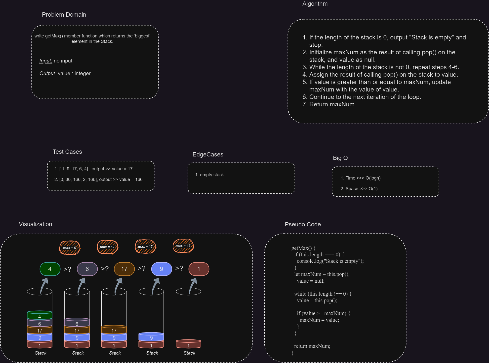

# The maximum element from the stack

## getMax() Function

The `getMax()` function is a method available in the Stack class. It is used to retrieve the maximum element from the stack.

## Whiteboard Process

---



### Syntax

```javascript
getMax()
```

### Return Value

- The function returns the maximum element in the stack.
- If the stack is empty, it throws an error message: "Stack is empty."

### Usage

```javascript
const stack = new Stack();
stack.push(5);
stack.push(2);
stack.push(10);

const max = stack.getMax();
console.log(max); // Output: 10
```

### Description

The `getMax()` function iterates through the stack to find the maximum element. It starts by popping the topmost element from the stack and assigns it as the current maximum (`maxNum`). Then, it continues to pop the remaining elements and compares each value with `maxNum`. If a value is greater than or equal to `maxNum`, it updates `maxNum` with that value. Finally, it returns the maximum value found.

### Complexity Analysis

- Time Complexity: O(n)
  - The function iterates through all the elements in the stack to find the maximum value.
- Space Complexity: O(1)
  - The function uses constant space without any additional data structures.

We hope this documentation provides a clear understanding of the `getMax()` function in the Stack class. If you have any further questions or need additional assistance, please let us know!
