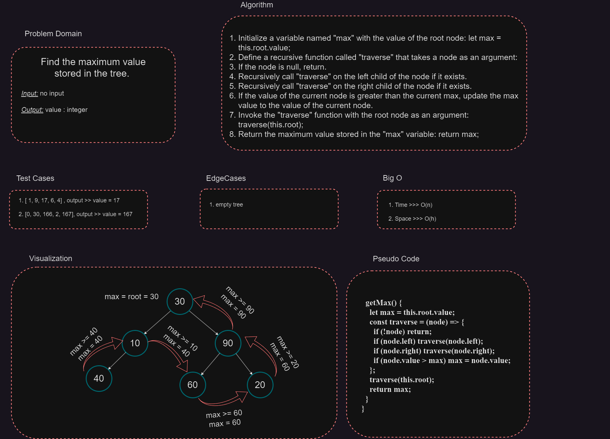

# Tree DS

## getMax()

The `getMax()` function is used to retrieve the maximum value from a binary tree.

## Whiteboard Process

---



### Usage

```javascript
let maximum = tree.getMax();
```

### Returns

The function returns the maximum value found in the binary tree.

### Algorithm

1. Initialize a variable `max` with the value of the root node.
2. Recursively traverse the binary tree using a depth-first search approach.
3. During traversal, compare the value of each node with the current maximum (`max`).
4. If a node's value is greater than `max`, update `max` to the value of that node.
5. Continue traversing the left and right subtrees recursively.
6. After traversing the entire tree, return the final value of `max`.

### Example

Consider the following binary tree:

```
        4
       / \
      7   2
     / \
    1   9
```

To find the maximum value from this tree:

```javascript
const tree = new BinaryTree();
// Construct the tree...

let maximum = tree.getMax();
console.log(maximum); // Output: 9
```

In this example, the maximum value in the binary tree is 9.

### Complexity Analysis

The time complexity of the `getMax()` function is O(N), where N is the number of nodes in the binary tree. This is because the function traverses each node exactly once. The space complexity is O(H), where H is the height of the binary tree, due to the recursive function calls on the stack.

It's important to note that the `getMax()` function assumes the binary tree is implemented correctly and is not empty. If the tree is empty, the function will return `undefined`.
