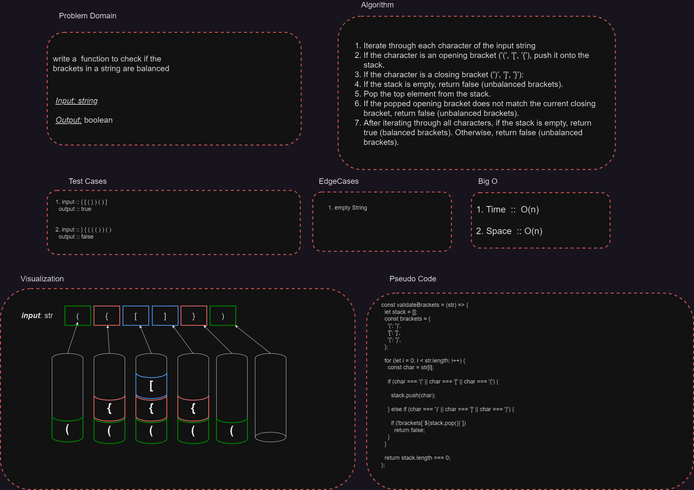

Certainly! Here's an example of a README.md file documentation for the `validateBrackets` function:

# Bracket Validation

This is a JavaScript function called `validateBrackets` that checks whether the brackets in a given string are balanced.

## Function Signature

```javascript
function validateBrackets(str: string): boolean
```

## Whiteboard Process

---



### Arguments

- `str` (string): The input string containing brackets to be validated.

### Return Value

- A boolean value representing whether the brackets in the string are balanced (`true`) or unbalanced (`false`).

## Bracket Types

The function considers three types of brackets:

1. Round Brackets: `()`
2. Square Brackets: `[]`
3. Curly Brackets: `{}`

## Algorithm

The `validateBrackets` function uses a stack-based algorithm to validate the brackets in the string.

1. Initialize an empty stack.
2. Iterate through each character in the input string.
3. If the character is an opening bracket, push it onto the stack.
4. If the character is a closing bracket:
   - If the stack is empty, return `false` (unbalanced brackets).
   - Pop the top element from the stack.
   - If the popped opening bracket does not match the current closing bracket, return `false` (unbalanced brackets).
5. After iterating through all characters, if the stack is empty, return `true` (balanced brackets). Otherwise, return `false` (unbalanced brackets).

## Example Usage

```javascript
console.log(validateBrackets('({})')); // true
console.log(validateBrackets('([)]')); // false
console.log(validateBrackets('({[]}[])')); // true
console.log(validateBrackets('({}')); // false
```

## Complexity Analysis

- Time Complexity: The time complexity of the `validateBrackets` function is O(n), where n is the length of the input string.
- Space Complexity: The space complexity is also O(n) in the worst case, as it uses a stack to keep track of opening brackets.

