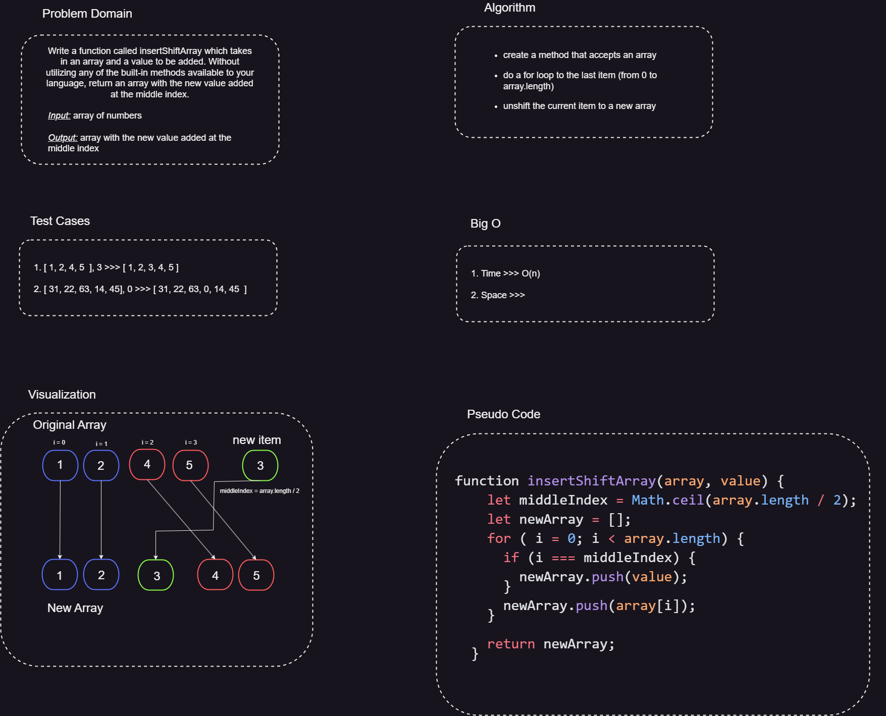

# Insert and shift an array in middle at index

## Whiteboard Process

## Approach & Efficiency

### In terms of approach, the function takes the following steps:

1. Calculates the middle index of the array using the formula Math.ceil(arr.length / 2).
2. Creates a new array to store the modified array.
3. Iterates through the original array using a for loop.
4. Checks if the current index is the middle index. If so, adds the value at the middle index to the new array.
5. Adds the current element from the original array to the new array.
6. Returns the modified array with the new value inserted at the middle index.

### In terms of efficiency, the function runs in O(n) time and O(n)

*The time complexity of the function is O(n)* because it iterates through the original array once, where n is the length of the array. Each iteration performs constant time operations, such as adding elements to the new array. Therefore, the time complexity grows linearly with the size of the input array.

*The space complexity of the function is O(n)* because it creates a new array to store the modified array. The size of the new array depends on the size of the original array. Therefore, the space complexity also grows linearly with the size of the input array.

## Solution

To run the code and see it in action, you can follow these steps:

* Declare the insertShiftArray function and provide the array and value as arguments.
* Call the function with the desired array and value to be inserted.
* Log the returned array to the console or use it as needed.
