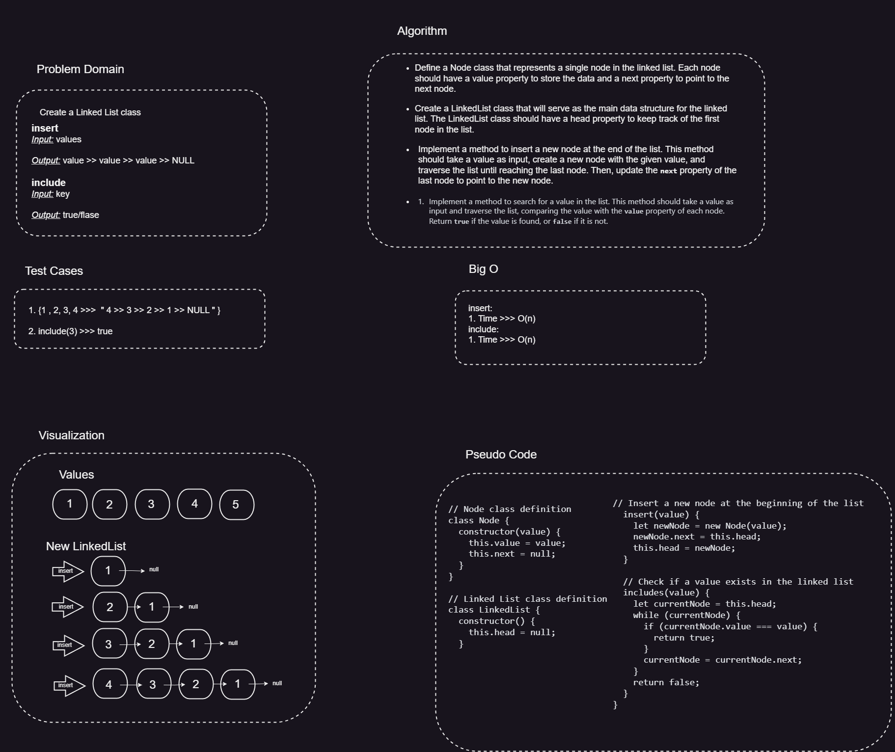

# LinkedList

The `LinkedList` class is a simple implementation of a singly linked list data structure in JavaScript. It allows you to create and manipulate linked lists efficiently.

## Features

- Insertion of nodes at the head of the list (O(1) time complexity)
- Insertion of nodes at the tail of the list (O(n) time complexity)
- Checking if a value exists in the list
- Converting the linked list into a string representation

## Whiteboard Process

---



## Usage

To use the LinkedList class in your JavaScript project, follow these steps:

1. Clone or download the repository to your local machine.
2. Include the `LinkedList.js` file in your project.
3. Create a new instance of the `LinkedList` class:

```javascript
const linkedList = new LinkedList();
```

4. Use the available methods to manipulate the linked list:

```javascript
linkedList.insertToHead(value); // Insert a new node with the specified value at the head of the list
linkedList.insertToTail(value); // Insert a new node with the specified value at the tail of the list
linkedList.includes(value); // Check if a node with the specified value exists in the list
linkedList.toString(); // Convert the linked list to a string representation
```

Please note that the `value` parameter represents the value to be inserted or searched for in the linked list.

## Examples

Here are some examples to demonstrate the usage of the LinkedList class:

```javascript

let newList = new LinkedList();

newList.insertToHead(1);
newList.insertToHead(2);
newList.insertToHead(3);
newList.insertToHead(4);
newList.insertToHead(5);

const newList2 = new LinkedList();

newList2.insertToTail(1);
newList2.insertToTail(2);
newList2.insertToTail(3);
newList2.insertToTail(4);
newList2.insertToTail(5);

console.log(newList.tostring());// Output: "5 >> 4 >> 3 >> 2 >> 1 >> NULL"
console.log(newList2.tostring());// Output: "1 >> 2 >> 3 >> 4 >> 5 >> NULL"

console.log(newList.includes(1));// Output: true
console.log(newList2.includes(10));// Output: false

```

The above example shows how to create a linked list and perform basic operations such as insertion and checking if a value exists. The `toString` method is also used to obtain a string representation of the linked list.

## License

This project is licensed under the [MIT License](LICENSE). You are free to use, modify, and distribute the code for personal or commercial purposes.

## Acknowledgements

- The implementation of the LinkedList class in this repository is inspired by various resources and tutorials on data structures and algorithms.

