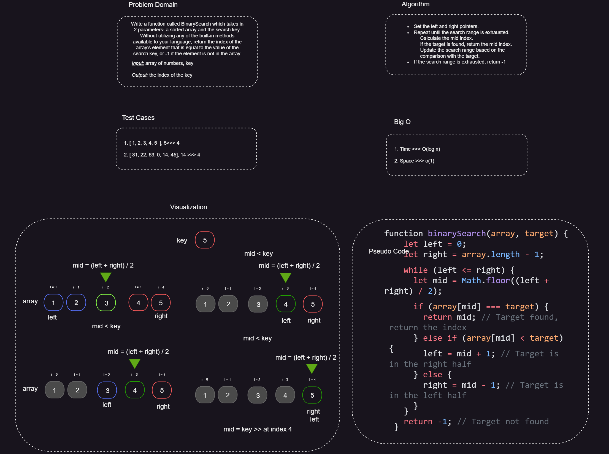

# Binary Search

## Description

Binary Search is an algorithm used to efficiently search for a target element in a sorted array. It repeatedly divides the search range in half, reducing the remaining elements to search and quickly zeroing in on the target.

## Whiteboard Process

---



## Approach & Efficiency

### In terms of approach, The Binary Search algorithm follows these steps:

1. Define the search range with left and right pointers.
2. Calculate the mid index as the average of the left and right pointers.
3. Compare the target element with the element at the mid index:
   - If they are equal, the target is found.
   - If the target is less than the mid element, update the right pointer to mid - 1.
   - If the target is greater than the mid element, update the left pointer to mid + 1.
4. Repeat steps 2-3 until the target is found or the search range is exhausted (left > right).

### In terms of efficiency,The Binary Search algorithm runs in O(log n) time and O(1)space

**The time complexity**of Binary Search is O(log n), where n represents the size of the input array. The logarithmic time complexity arises from the fact that the search range is halved at each step, leading to efficient searching even in large arrays.

**The space complexity** is O(1) as the algorithm does not require additional space that scales with the input size.

## Example
```javascript
// Binary Search function
function binarySearch(array, target) {
  let left = 0;
  let right = array.length - 1;

  while (left <= right) {
    let mid = Math.floor((left + right) / 2);

    if (array[mid] === target) {
      return mid; // Target found, return the index
    } else if (array[mid] < target) {
      left = mid + 1; // Target is in the right half
    } else {
      right = mid - 1; // Target is in the left half
    }
  }

  return -1; // Target not found
}

// Example usage
const array = [2, 4, 6, 8, 10];
const target = 6;
const index = binarySearch(array, target);
console.log(index); // Output: 2 (index of target element)
```

In this example, the Binary Search algorithm is used to search for the target element 6 in the given array [2, 4, 6, 8, 10]. The function returns the index 2, indicating that the target element was found at that position in the array.
