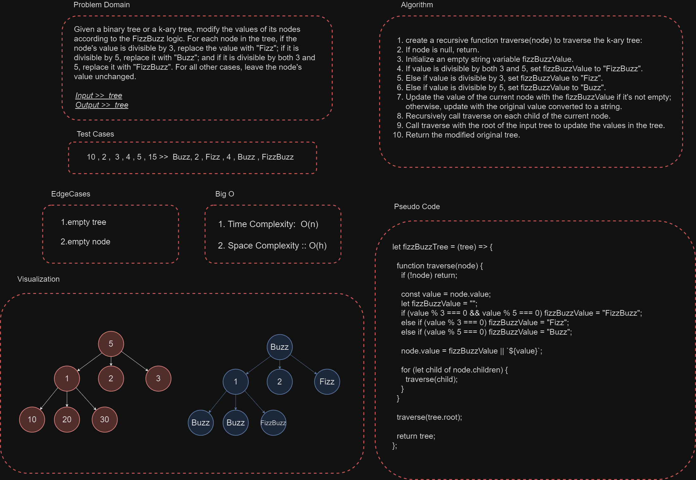

**FizzBuzz Tree**



**Description**

FizzBuzz Tree is a problem-solving algorithm that applies the classic FizzBuzz logic to the nodes of a k-ary tree. The FizzBuzz logic involves transforming the node values based on certain conditions. If a node's value is divisible by 3, the value is replaced with "Fizz". If it is divisible by 5, the value is replaced with "Buzz". If it is divisible by both 3 and 5, the value is replaced with "FizzBuzz". For all other cases, the node's value remains unchanged.

**Usage**

To use the FizzBuzz Tree algorithm, follow these steps:

1. Clone the repository to your local machine or include the FizzBuzz Tree script in your project.

2. Ensure you have a binary tree or k-ary tree data structure in place. You can use the provided `KaryTree` class as a starting point or modify the algorithm to work with your specific tree implementation.

4. Create an instance of your binary tree or k-ary tree and populate it with values.

5. Call the `fizzBuzzTree` function, passing your tree as an argument.

6. The function will apply the FizzBuzz transformation to the node values of your tree in place.

7. You can now traverse the modified tree to see the updated node values or perform any additional operations as needed.

**Example**

```javascript

// Assuming you have a binary tree with the following structure:
//        15
//       /  \
//      9    10
//     / \   / \
//    12  30 16  21

// Create the binary tree and populate it with the values above

// Apply the FizzBuzz transformation to the tree
fizzBuzzTree(binaryTree);

// Traverse the tree and see the updated node values
binaryTree.postorderTraversal();

// Output will be:
// FizzBuzz
// Fizz
// Buzz
// Fizz
// FizzBuzz
// 16
// Fizz

```

**Complexity**

The time complexity of the FizzBuzz Tree algorithm is O(n), where 'n' is the number of nodes in the tree. This is because the algorithm performs a depth-first traversal of the tree, visiting each node once.

The space complexity is O(h), where  is the  (height) of the tree. This is due to the space used by the recursive call stack during the traversal process.
