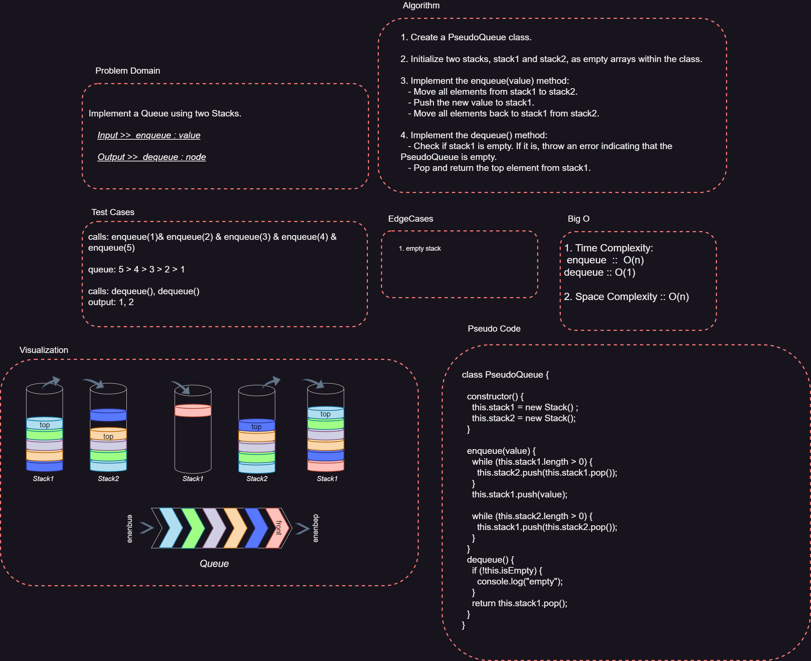

# PseudoQueue

**PseudoQueue - A First-In-First-Out (FIFO) Queue Using Two Stacks**

## Overview

PseudoQueue is a JavaScript class that implements a First-In-First-Out (FIFO) queue using two stacks. It allows you to perform enqueue and dequeue operations with time complexity optimizations, maintaining the order of elements in a queue-like manner.

## Features

- Enqueue: Add elements to the queue in a first-in, first-out order.
- Dequeue: Remove and retrieve elements from the front of the queue in a first-in, first-out order.

## Whiteboard Process

---



## Usage

1. Import the `PseudoQueue` class in your JavaScript file:

   ```javascript
   const PseudoQueue = require('./PseudoQueue');
   ```

2. Create an instance of the `PseudoQueue` class:

   ```javascript
   const queue = new PseudoQueue();
   ```

3. Enqueue elements:

   ```javascript
   queue.enqueue(1);
   queue.enqueue(2);
   queue.enqueue(3);
   ```

4. Dequeue elements:

   ```javascript
   const dequeuedElement = queue.dequeue();
   console.log(dequeuedElement); // Output: 1
   ```

## Methodes

### `enqueue(value)`

Adds the given `value` to the back of the queue.

- **Parameters:**
  - `value`: The value to be added to the queue.

### `dequeue()`

Removes and returns the element from the front of the queue.

- **Returns:**
  - The element removed from the front of the queue.

## Example

```javascript
const PseudoQueue = require('./PseudoQueue');

const queue = new PseudoQueue();
queue.enqueue(1);
queue.enqueue(2);
queue.enqueue(3);

console.log(queue.dequeue()); // Output: 1
console.log(queue.dequeue()); // Output: 2
```

